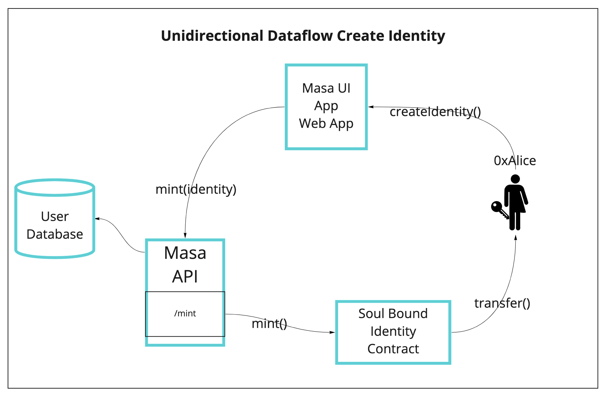
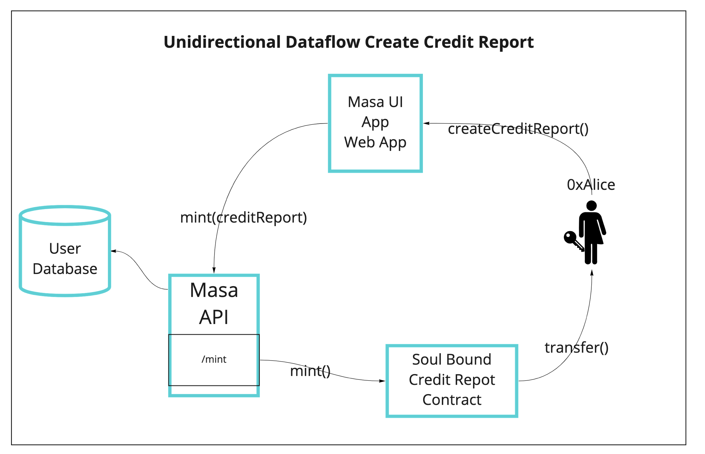

# Introduction

In order to create the first decentralized credit bureau Masa implements a set of soulbound NFT Tokens using the ERC-721
standard. The following components are attributed to a users account during each step of the lending lifecycle. Metadata
attributed to a soulbound token encrypted and can only be accessed with permission from the owner through the Masa API.

## Identity

The Masa Identity is a soulbound NFT Identity that is generated for a user when they sign up to the Masa protocol and
includes the following information:

## Credit Report

The Masa NFT Credit Report enables the bridging and aggregation of on and off-chain data in order to create a hybrid
decentralized credit report. The Masa credit report can include the following information depending on which region you
are located (read a full list of supported
countries [here](https://developers.masa.finance/docs/supported-countries)):

- Credit Bureau Data
- Bank Transaction Data
- Mobile Money Data
- On-chain Data
- Centralized Exchange Data

## Tokenized Loan Applications

Masa tokenizes all loan applications that are attributed to a Masa Identity and users account as a soulbound token.
Once a loan application is approved a tokenized loan is created.

## Tokenized Loans

Masa tokenizes all loans that are attributed to a Masa Identity and users account. Loan applications can have the
following states that get updated throughout their lifecycle:

- pending
- approved
- disapproved
- on-time
- repaid
- late-30
- late-60
- late-90
- collections
- defaulted

# Masa API

Masa’s soulbound NFTs have their metadata stored in the Masa API which is updated in real time with verified data
throughout the lifecycle of the user. The Masa API has the following endpoints available with metadata data schema’s for
attribution to the soulbound NFT’s URI.

## Identity

### Metadata URI

`https://api.masa.finance/v1.0/identity/`

### **JSON Schema**

A unique JSON schema is created for each user with the following format.

`GET https://api.masa.finance/v1.0/identity/{id}`

Where `{id}` is a unique 32 character ID that is numeric characters only

Token ID’s for Identity have the `1` prefix for the TokenID and metadata `{ID}`

`10000000000000000000000000000000`

Public Request `GET https://api.masa.finance/v1.0/identity/17012826615246396599027510140925`:

Response:

```json
{
  "name": "Alice",
  "imageUrl": "https://i.etsystatic.com/26285683/r/il/a9f0bd/2807723995/il_340x270.2807723995_nzaw.jpg"
}
```

Gated Request `POST https://api.masa.finance/v1.0/identity/17012826615246396599027510140925`:

```json
{
  "address": "0xAlice",
  "signature": "0x21fbf0696d5e0aa2ef41a2b4ffb623bcaf070461d61cf7251c74161f82fec3a4370854bc0a34b3ab487c1bc021cd318c734c51ae29374f2beb0e6f2dd49b4bf41c"
}
``` 

Response:

```json
{
  "name": "Alice",
  "imageUrl": "https://i.etsystatic.com/26285683/r/il/a9f0bd/2807723995/il_340x270.2807723995_nzaw.jpg",
  "lastName": "Cooper",
  "loan_applications": [
    {
      "index": 1,
      "application_id": "0xf51ff2eec7fa35462a4eff2ece7d17d88586569a?a=27012826615246396599027510140925"
    },
    {
      "index": 2,
      "application_id": "0xf51ff2eec7fa35462a4eff2ece7d17d88586569a?a=27012826615246396599027510140925"
    }
  ],
  "loans": [
    {
      "index": 1,
      "loan_id": "0xf51ff2eec7fa35462a4eff2ece7d17d88586569a?a=37012826615246396599027510140925"
    }
  ],
  "associated_accounts": [
    "0x7ef964Ac45ff620d13d4aB130aCC5bFf7261009F",
    "0x25553828F22bDD19a20e4F12F052903Cb474a335",
    "0x2c5B9dd42d0510C43f1d6d672bD56A7DE0716c91",
    "0xAlice"
  ]
}
```

## Credit Report

### Metadata URI

`https://api.masa.finance/v1.0/credit-report/`

### **JSON Schema**

A unique JSON schema is created for each user with the following format.

`GET https://api.masa.finance/v1.0/credit-report/{id}`

Where `{id}` is a unique 32 character ID that is numeric characters only

Token ID’s for Identity have the `2` prefix for the TokenID and metadata `{ID}`

`20000000000000000000000000000000`

## Tokenized Loan Applications

### Metadata URI

`https://api.masa.finance/v1.0/loan-applications/`

### **JSON Schema**

A unique JSON schema is created for each user with the following format.

`GET https://api.masa.finance/v1.0/loan-applications/{id}`

Where `{id}` is a unique 32 character ID that is numeric characters only

Token ID’s for Tokenized Loan Applications have the `3` prefix for the TokenID and metadata `{ID}`

`30000000000000000000000000000000`

## Tokenized Loans

### Metadata URI

`https://api.masa.finance/v1.0/loans/`

### **JSON Schema**

A unique JSON schema is created for each user with the following format.

`GET https://api.masa.finance/v1.0/loans/{id}`

Where `{id}` is a unique 32 character ID that is numeric characters only

Token ID’s for Tokenized Loans have the `4` prefix for the TokenID and metadata `{ID}`

`40000000000000000000000000000000`

# Masa Soul Bound NFT API

In order to seamlessly interact with the Masa Soul Bound NFT API. Masa implements an API that is used to perform all
actions
on the deployed SBT smart contract. The Masa SBT contract is upgradable. The required actions are as follows:

# Masa Soul Bound NFT base URI

`https://api.masa.finance/v1.0/{endpoint}/{id}`

## Masa Soul Bound NFT Endpoints

### Functions

The Masa API has control over some functions of the SBT. Some of those functions can be used via this the Masa API

### `mint` - Mints a given SBT and transfers it to the users wallet

Create Identity:


Create Credit Report:


Endpoint: `POST https://api.masa.finance/v1.0/mint`

Request `POST`:

```json
{
  "type": "identity | credit-report | loan-application | loan"
}
``` 

Response:

```json
{
  "success": true,
  "tokenAddress": "0x0ffF769274a4fDa68Bf6E99FE0982c4c26B1A4A0",
  "tokenId": "17012826615246396599027510140925"
}
```

### Additional Resources

- [Soul Bound Identity](https://github.com/masa-finance/nft-credit-report/blob/bd57ca5f3c6220f92096303a9bc3d48a618800bd/docs/SoulBoundIdentity.md)
- [Soul Bound Credit Report](https://github.com/masa-finance/nft-credit-report/blob/bd57ca5f3c6220f92096303a9bc3d48a618800bd/docs/SoulBoundCreditReport.md)
- [Soul Linker](https://github.com/masa-finance/nft-credit-report/blob/bd57ca5f3c6220f92096303a9bc3d48a618800bd/docs/SoulLinker.md)

# Relevant Repositories

## Frontends

- [Web App](https://github.com/masa-finance/masa-web-app)
- [Mobile App](https://github.com/masa-finance/masa-mobile-app)

## Backend

- [SDK](https://github.com/masa-finance/masa-sdk)
- [API Middleware](https://github.com/masa-finance/masa-api-middleware)
- [API](https://github.com/masa-finance/masa-api)

## Contracts

- [Lending Contracts](https://github.com/masa-finance/masa-contracts-lending)
- [Identity Contracts](https://github.com/masa-finance/masa-contracts-identity)

## Blockchain

- [Node](https://github.com/masa-finance/masa-node-v1.0)
- [Node UI](https://github.com/masa-finance/node-ui)
- [Node Cluster](https://github.com/masa-finance/masa-node-cluster)
